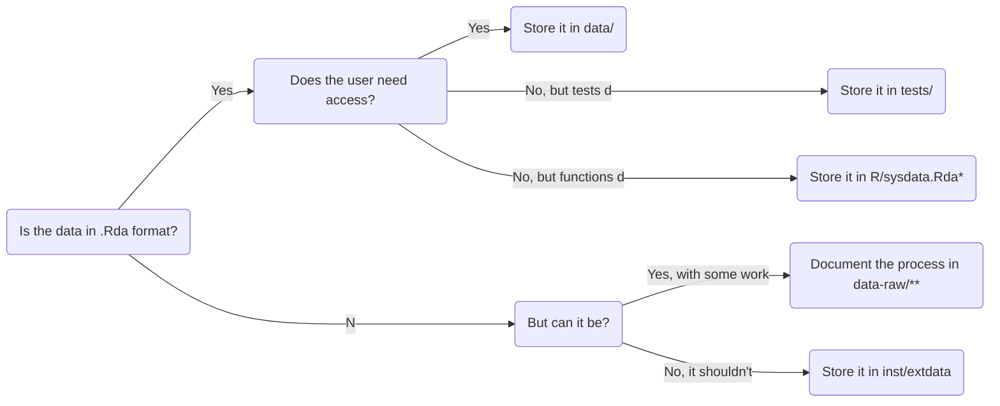

# Collaborative Document - week 4

2022-10-05 Reproducible Research with R Packages

Welcome to The Workshop Collaborative Document.

This Document is synchronized as you type, so that everyone viewing this page sees the same text. This allows you to collaborate seamlessly on documents.


## 👮Code of Conduct

Participants are expected to follow these guidelines:
* Use welcoming and inclusive language.
* Be respectful of different viewpoints and experiences.
* Gracefully accept constructive criticism.
* Focus on what is best for the community.
* Show courtesy and respect towards other community members.

## ⚖️ License

All content is publicly available under the [Creative Commons Attribution License 4.0](https://creativecommons.org/licenses/by/4.0/).

## 🙋Getting help

To ask a question, raise your hand in the zoom window, or ask a question in the chat.

You can ask questions in the document or chat window and helpers will try to help you.

## 🖥 Workshop website

💻 [Workshop website](https://esciencecenter-digital-skills.github.io/2022-09-14-ds-rpackaging/)

🛠 [Setup instructions](https://esciencecenter-digital-skills.github.io/2022-09-14-ds-rpackaging/#setup)

[post-workshop survey](https://www.surveymonkey.com/r/69VGKQM)

## 👩‍🏫👩‍💻🎓 Instructors

Barbara Vreede, Lieke de Boer

## 🧑‍🙋 Helpers

Eva Viviani, Pranav Chandramouli, Djura Smits, Ji Qi

## 🗓️ Agenda
Day 4. Wed 5 October 2022
| Time | Topic |
|--:|:---|
| 09:00 	| Welcome and icebreaker
| 09:15 	| Recap and lessons learned, data
| 10:15 	| Coffee break
| 10:30 	| Data (cont), Vignettes
| 11:30 	| Coffee break
| 11:45 	| Sharing our packages
| 12:45 	| Wrap-up
| 13:00 	| END

## 🔧 Exercises

### Data
#### Exercise: add data to your package

First, some reference information:


`*`) `R/sysdata.Rda` is a file dedicated to (larger) data needed by your functions. [Read more about it here](https://r-pkgs.org/Data.html#sec-data-sysdata).
`**`) `data-raw/` is a folder dedicated to the origin and cleanup of your data. [Read more about it here](https://r-pkgs.org/Data.html#sec-data-data-raw).

**And now the exercise: add data to your package!**


- Do you need raw data as part of your package?
    - Create a folder `inst/extdata`, and save the files here. Note that a user will be able to access this data.
    - When loading the data, do not describe the path as you usually would. Instead, use something like:
        ```r
        filepath <- system.file("extdata", "names.csv", package = "mysterycoffee")
        names <- read.csv(filepath)
        ```
- Do you need data you can store in your package as an .Rda file?
    - Create the object
    - Store it with `usethis::use_data(object_name)`
    - Verify the object is now stored in the `data/` folder
    - Create a new R file called `data.R`: `usethis::use_r("data")` (`data/R` is an example; you may call this whatever you want)
    - In this file, document the data object, using this example:
        ```
        #' Title
        #'
        #' A short description.
        #'
        #' @format What format is the data in?
        #' @source Where did it come from? \url{https://google.com}
        "object_name"
        ```
    - Don't forget to call `devtools::document()` to generate the documentation file and add this data to the package namespace. This will also add an entry into the NAMESPACE.

You can now call the dataset in this way:

``` r
mysterycoffee::object_name
```

You can also check its documentation by using `?`:
``` r
library(mysterycoffee)
?object_name
```

TIP: if you wish to make available to the package users large datasets (e.g., 1GB), a possibility is to add a function to your package to download the data, without having to store it on your package.

TIP2: be sure not to add the extension of the data file to your documentation. E.g.:
```
#' Title
#'
#' A short description.
#'
#' @format What format is the data in?
#' @source Where did it come from? \url{https://google.com}
"object_name"
```
Where `"object_name"` should NOT be `"object_name.rda"`


#### Exercise: add a vignette.
- Use `usethis::use_vignette(vignette-name)` to create a vignette fit for your package.
- In the .Rmd file that is now created, add a code chunk that uses a function from your package. (Feel free to add some descriptive text, too!)
- Preview the vignette with the Knit button.
- Create the vignette with `devtools::build_rmd("vignettes/vignette-name.Rmd")` (!not necessary after all! Sorry guys :))
- Verify that the vignette was built: a .html file should now appear in the vignettes/ folder.


TIP! To look at your vignette:
```r
remotes::install_local(build_vignettes = TRUE, force=TRUE)
browseVignettes("package-name")
```
You do not need to generate the HTML in your package. The .Rmd file is sufficient, when the package is built, it will generate the HTML file.


### Share your package (final exercise)
As the final exercise today, we will share the packages we created with each other.

- On your GitHub profile, add a new repository (with the name of your package).
- Upload the entire package to the repository.
- Ensure your README file contains:
    - Instructions to install the package
    - A first function or small script to run (or: a link to the Vignette that contains this).
- Place the link to the package in the table below.
- Find a package from another user, install it and run their example. Comment BELOW the table (otherwise it will become a mess).


#### Comments from users

### AbSolution
Really nice, install worked well! Like the fact that the hello() function does different things with numbers and text :)

Ia dded the build_vignettes and it worked, supernice :)

Different functionality implemented which is good.

Install worked fine. README could use a bit more detail.

### Scifighter
Really cool game :) Impressed by how you made this in such a short time. Massive pro is how clear and easy it is to install and play due to the vignette.

Interesting package, a lot to look into. Vignettes/README provides very less information.

This was really entertaining. The only thing I experienced was the following when installing:

These packages have more recent versions available.
It is recommended to update all of them.
Which would you like to update?
: this is normal, as you install. You can choose to update dependencies that are already installed on your system, or leave them as is. Take a look at the version numbers to make this decision!

: I chose all and there were some errors in installing. Didn't affect the library itself though, nice game.

: Nice game, very entertaining, it crashed my R after 3 itterations though
: (suggestion: Try without the sound :) Beepr is a bit difficult..

### testPackage
Seems to work fine! I tested it using the testdata.pdf.
temp <- emailPDFdf("./testdata.pdf") and was able to retrieve all email info.

Nice package,

### cmoc
Whoa, this looks official! Starting at the badges on the README, but in use this is also very cool!
All works as expected :)

### addOptics

### brainlink

Installs nicely. Could use a bit more explanation in the vignette of what is happening


### ColPal
How cool! I made a pie chart :)
Installation and using basic functions worked as expected!


## 🧠 Collaborative Notes

Tip: you can automatically generate a readme file by typing:

``` r
usethis::use_readme_md()
```

## What is a Vignette?

A vignette is a manual of your package. You can (for example) show how to use your package, or how to install it. Let's look at some examples from the function browseVignettes()

```r
browseVignettes()
```

browseVignettes automatically opens a new browser listing available R vignettes. Let's look at the vignette for `knitr`:

``` r
browseVignettes("knitr")
```

this will open the `knitr` web page whereby we will click on the `HTML` link in the `An R Markdown Vignette with knitr` row.

## Create a Vignette

The function `browseVignettes()` allows us to look at the vignette. Let's see how we can write our own now. By looking at the `knitr` vignette, we immediately recognise that the document is a canvas written in [`Rmarkdown`](https://rmarkdown.rstudio.com/). In Rmarkdown, we combine code and text together. It is a powerful way to organise your workflow by displaying plot and table outputs, along the relevant code to reproduce them.

To add R-code in Rmarkdown, simply click on the green square with a C+ icon, and select `R`. This will automatically insert this chunk:

```
```{r}```
```

This will show AND execute your code. However, in Rmarkdown you can also show the code without executing it in the console. You can achieve this result by adding `eval = False` in the R-chunk:

```
```{r eval = False}
print('hello world')
```

Let's save the file as `my-report.Rmd`.

NOTE: `Rmd` is the Rmarkdown format.

## Build the Vignette:

``` r
usethis::use_vignette("my-report")
```

This command will build your vignette, and it will add in your DESCRIPTION file also the relevant dependencies.

NOTE: in order to build the vignette (which in turn calls Rmarkdown) you may have to install `knitr`, which is the vignette-builder package.

### How to add R code to your vignette

You can click the green C+ button on the top-right part of R-studio window, this will add the shortcut automatically into your document. Let's add also some meaningful code in our R-chunk, in this case, we use the `make_groups()` function:

```
```{r}
make_groups(example_names)
```

If we click on the blue yarn icon `Knit`, this will execute all the r-chuncks and text to render an HTML page. This is the preview of your vignette. To generate the `.html` file, you can run:

``` r
devtools::build_rmd("vignettes/my-report.Rmd")
```

You can now browse your compiled vignette by typing:
``` r
browseVignettes("mysterycoffee")
```

TIP: if browseVignettes('yourpackagename') doesn't work, run:

``` r
remotes::install_local(build_vignettes = TRUE, force = TRUE)
```

## How to upload your package on Github

Go to [Github](www.github.com). In the top-right side of the browser, click on the `+` symbol, then `create repository`. Name the repository with the name of the package `misterycoffee`. Tick on `Public` only. Click on `Create repository`.

This will open a new web page whereby there is a blue bar: `Quick setup`. We're going to click on that. This will brings us to the repository page whereby we can `Drag files here to add them to your repository` or `choose your files`. I upload my package and I click on `submit changes`.

At this point, our github repository will contain all the package's files/folders. You can take a look at the repository we have just built in this lesson at this link: [mysterycoffee-github-repository](https://github.com/bvreede/mysterycoffee).

We're going to edit now the `README.md` file. This file will contain useful information about your package, along with the instruction on how to install it. In order to modify it, click on `README.md`, click on the pencil icon to enter the edit mode. Add the following:

``` r
devtools::install_github("bvreede/mysterycoffee", build_vignettes = TRUE)
```

This line of code explains how to install your package to anyone. To save your changes, click on the green button `Commit changes`.

#### EXTRA: To install a package loaded on Github

As also suggested in the readme, you can simply run:

``` r
devtools::install_github("owneroftherepo/package-I-want-to-Install", build_vignettes = TRUE)
```

and you're ready to install any package on github that you are interested in!
Have fun!

## 📚 Resources
[differences between r data files](https://stackoverflow.com/questions/21370132/what-are-the-main-differences-between-r-data-files)
[research papers as r packages](https://link.springer.com/article/10.3758/s13428-020-01436-x)
[mysterycoffee-github-repository](https://github.com/bvreede/mysterycoffee)
[Introduction to version control with Git](https://swcarpentry.github.io/git-novice/)
